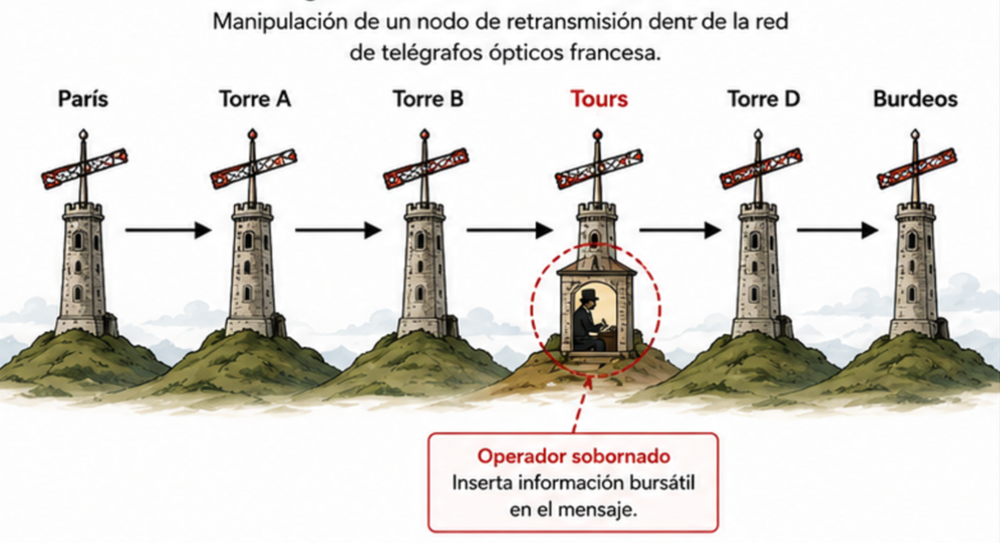
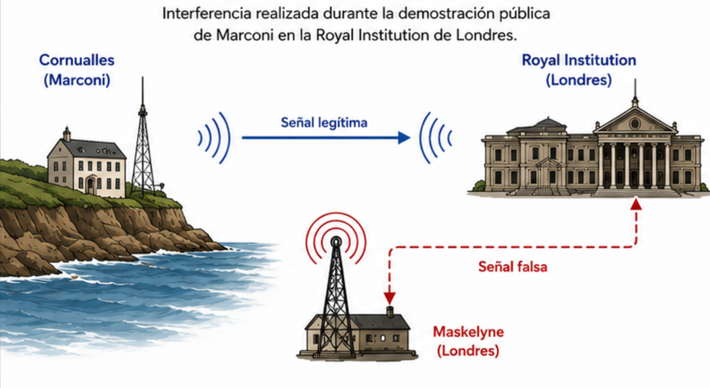
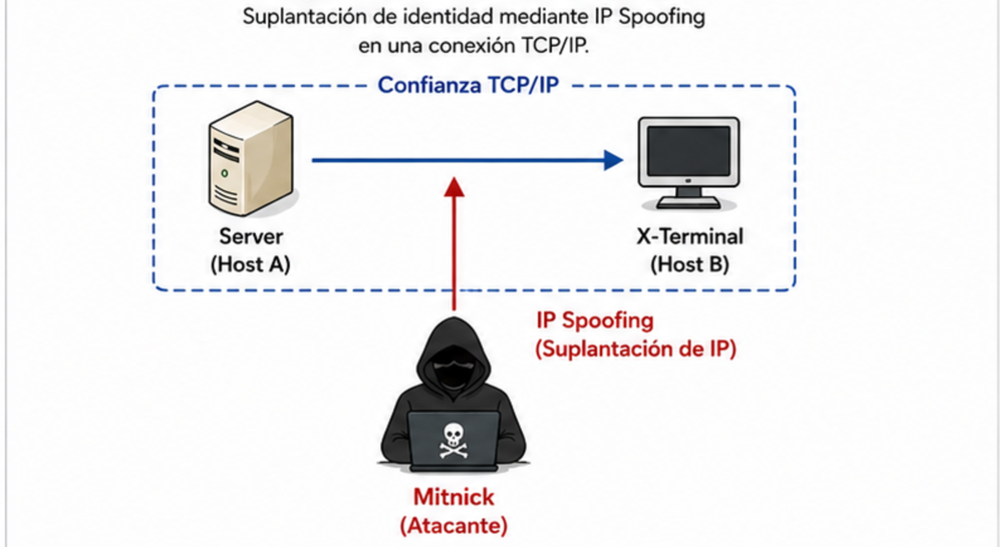
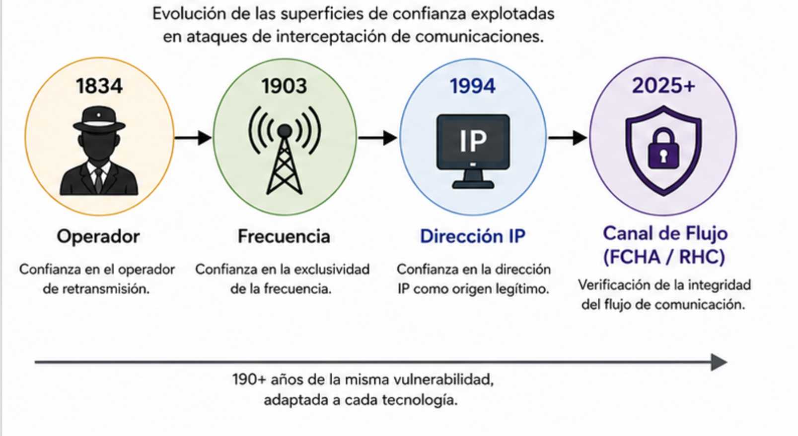

> ℹ️ **Note:** This document is written in Spanish. You can use your browser to translate it into English.
> The Spanish version is preserved intentionally as part of the project's authorship and intellectual identity.

# Las Raíces Históricas de la Intercepción de Comunicaciones

**Autor:** Fernando Flores Alvarado  
**Proyecto Original:** RHC Protocol Core — (Randomized Header Channel)  
**Proyecto OWASP:** Randomized Header Channel for CSRF Protection (RHC)  
**Licencia:** CC BY 4.0 (documentación)  
Información detallada sobre versiones, fechas, estado y metadatos completos, consulta [`VERSION.md`](../VERSION.md).

---

## Por Qué la Confianza en un Canal Siempre Ha Sido una Ilusión

*Un análisis histórico preparado para el proyecto **RHC Protocol Core**, basado en el concepto **Randomized Header Channel for CSRF Protection (RHC)**.*

---

> *"Quienes no pueden recordar el pasado están condenados a repetirlo."*
> — George Santayana

---

## Introducción

Antes de que existiera HTTP. Antes de que existiera TCP/IP. Antes incluso de que la electricidad recorriera un cable de cobre — **alguien ya estaba interceptando comunicaciones que no tenía derecho a leer.**

El ataque que hoy conocemos como Man-in-the-Middle (MITM) no es un producto de la era digital. No es una invención de los hackers de la década de 1990, ni una consecuencia de Internet. Es una **vulnerabilidad estructural presente en cada sistema de comunicación que los seres humanos han construido**: la suposición implícita y no verificada de que el canal que conecta a dos partes es privado, confiable y permanece inalterado.

Este documento recorre una línea ininterrumpida desde 1834 hasta 1994: tres casos emblemáticos, tres tecnologías diferentes y una misma falla fundamental. También explica por qué, 190 años después, el Randomized Header Channel (RHC) existe para responder una pregunta que la historia ha estado formulando desde entonces:

**¿Qué se necesita para que dos partes puedan confiar verdaderamente en el canal que las conecta?**

---

## Caso 1 — 1834: Los Hermanos Blanc

### *El Primer Ataque Man-in-the-Middle Conocido en la Historia*

**Quiénes:** François y Joseph Blanc — corredores de bolsa franceses de Burdeos.  
**Objetivo:** La red gubernamental francesa de telégrafos ópticos de semáforo.  
**Método:** Soborno e inyección de señales.  
**Motivación:** Beneficio financiero mediante asimetría de información.  

### Contexto

Durante la década de 1790, Francia construyó una de las redes de comunicación más avanzadas de su época: una cadena de torres llamadas *télégraphes optiques*, que utilizaban brazos mecánicos móviles para retransmitir mensajes codificados a través de cientos de kilómetros. Este sistema de semáforos era la columna vertebral de las comunicaciones gubernamentales: rápido, estructurado y considerado seguro porque solo los operadores autorizados podían interpretar el código.

La red se extendía desde París hasta Burdeos. Para la década de 1830, los mercados financieros ya se habían desarrollado lo suficiente como para que recibir noticias desde la capital apenas unos minutos antes que los competidores pudiera significar fortuna o ruina.

### El Ataque

Los hermanos Blanc comprendieron algo que los arquitectos del sistema no habían considerado por completo: **la seguridad es tan fuerte como las personas que operan el canal.** Identificaron un nodo humano crítico: un operador de la estación de retransmisión de Tours, y lo sobornaron para participar en su esquema.

La función del operador era simple pero elegante: introducir deliberadamente un carácter erróneo dentro de los mensajes oficiales del gobierno, seguido inmediatamente por la propia señal de corrección de la red, equivalente a un *backspace*, que indicaba al siguiente operador que ignorara el carácter anterior. Ese carácter erróneo, invisible para el destinatario final, contenía información codificada sobre el mercado bursátil. La contraparte en Burdeos lo descifraba, realizaba operaciones financieras basadas en la información adelantada y obtenía ganancias.

Durante dos años, el esquema funcionó sin ser detectado. El canal parecía correcto en ambos extremos. El mensaje gubernamental llegaba intacto. Nadie veía el fantasma en medio del canal... hasta que el operador de Tours enfermó gravemente y, en su lecho de muerte, intentó reclutar a un reemplazo que sí tenía conciencia.

### Consecuencias

Cuando el esquema fue descubierto, las autoridades francesas se enfrentaron a una paradoja legal: **no existía ninguna ley que prohibiera el abuso de la red telegráfica.** Los hermanos Blanc fueron procesados, pero no pudieron ser condenados. Quedaron en libertad.

El gobierno francés reaccionó de inmediato creando legislación para criminalizar el abuso de redes de comunicación, convirtiéndose en una de las primeras leyes de ciberseguridad de la historia, más de un siglo antes de la aparición de las computadoras.

### La Vulnerabilidad Fundamental

El ataque no rompió el código del semáforo. No derrotó a la red. Explotó el **nodo de retransmisión confiable**: la suposición de que cada operador de la cadena transmitiría fielmente lo que recibía.

El modelo de seguridad asumía participantes honestos.

Los atacantes simplemente corrompieron a uno de ellos.

---

## Caso 2 — 1903: Nevil Maskelyne

### *La Primera Intercepción de una Red Inalámbrica*

**Quién:** Nevil Maskelyne — inventor británico, mago e investigador de comunicaciones inalámbricas.  
**Objetivo:** La demostración pública de la telegrafía inalámbrica "segura" de Guglielmo Marconi en la Royal Institution de Londres.  
**Método:** Un transmisor de radio independiente operando en la misma frecuencia.  
**Motivación:** Demostrar que las afirmaciones de seguridad de Marconi eran falsas.  

### Contexto

Para 1903, Marconi se había convertido en el célebre padre de la telegrafía inalámbrica. Su empresa comercializaba la tecnología a gobiernos, armadas y corporaciones con una promesa audaz: **las transmisiones inalámbricas eran privadas y seguras**, porque cada estación operaba en una frecuencia ajustada que no podía ser interceptada sin estar exactamente en la misma frecuencia.

El asesor de Marconi, el profesor John Ambrose Fleming, preparaba una demostración pública histórica en la Royal Institution de Londres: una transmisión inalámbrica en vivo desde una estación en Cornualles hasta la capital. El objetivo era demostrar la fiabilidad y seguridad de la tecnología ante una prestigiosa audiencia científica.

Maskelyne, que desarrollaba sus propias investigaciones en comunicaciones inalámbricas y que había sido prácticamente excluido del mercado debido a las amplias patentes de Marconi, decidió responder de la única manera que conocía: con una demostración propia.

### El Ataque

Semanas antes del evento, Maskelyne instaló un transmisor en el techo del teatro familiar que operaban en Londres. Lo ajustó a la misma frecuencia utilizada por la demostración de Marconi.

El 4 de junio de 1903, mientras Fleming y su audiencia esperaban el inicio de la transmisión desde Cornualles, el receptor ubicado en el auditorio comenzó a imprimir mensajes.

Pero no eran los mensajes de Marconi.

En su lugar, apareció una secuencia de mensajes en código Morse enviados por Maskelyne, burlándose de Marconi y exponiendo públicamente que la demostración podía ser interferida.

Fleming, enfurecido, escribió al periódico *The Times* exigiendo que el responsable se identificara, calificando el incidente como un acto de **"vandalismo científico"**.

Cuatro días después, Maskelyne respondió públicamente mediante una carta enviada al mismo periódico. En ella asumió toda la responsabilidad, explicó exactamente cómo había realizado la intervención y concluyó con una declaración contundente:

> *"Los hechos anteriormente mencionados demuestran muchas cosas. Personalmente, estoy completamente satisfecho con los resultados obtenidos."*

### Consecuencias

La reputación de Marconi sobrevivió al incidente, pero el evento envió una señal inequívoca a todas las instituciones que consideraban adoptar la tecnología inalámbrica:

**El canal no era inherentemente privado.**

La conciencia sobre la necesidad de proteger las comunicaciones inalámbricas mediante mecanismos de cifrado se extendió rápidamente entre gobiernos y organizaciones militares.

A partir de ese momento, el desarrollo de protocolos de comunicación seguros comenzó a ser tratado con mucha más seriedad.

Actualmente, numerosos historiadores de la ciberseguridad consideran a Maskelyne uno de los primeros hackers éticos de la historia: un investigador que descubrió una vulnerabilidad, la demostró públicamente, documentó su funcionamiento y asumió la responsabilidad de sus acciones.

### La Vulnerabilidad Fundamental

El modelo de seguridad de Marconi descansaba sobre una premisa:

**La exclusividad de una frecuencia implicaba la exclusividad del canal.**

Maskelyne demostró que no era así.

Conocer la frecuencia era suficiente para introducirse en el canal.

El sistema no tenía ningún mecanismo para verificar que la señal recibida provenía realmente del emisor esperado.

¿Te resulta familiar?

---

## Caso 3 — 1994: Kevin Mitnick

### *El Primer Ataque MITM Documentado en el Internet Moderno*

**Quién:** Kevin David Mitnick — alias *"Condor"* — en aquel momento, el ciberdelincuente más buscado de los Estados Unidos.  
**Objetivo:** Tsutomu Shimomura — físico computacional y experto en seguridad informática del San Diego Supercomputer Center.  
**Método:** Suplantación de IP (*IP Spoofing*) combinada con predicción de números de secuencia TCP, una técnica que hasta ese momento había existido principalmente en documentos teóricos de seguridad.  
**Motivación:** Robo de software especializado relacionado con la seguridad de redes celulares desarrollado por Shimomura.  

### Contexto

A finales de 1994, Kevin Mitnick era un fugitivo del FBI con años de intrusiones informáticas a sus espaldas. Había ampliado sus actividades hacia la investigación y explotación de redes de telefonía celular, y necesitaba software especializado para continuar avanzando en ese trabajo.

Sus investigaciones lo llevaron hasta Tsutomu Shimomura, uno de los investigadores más reconocidos en seguridad de redes celulares y propietario precisamente del software que Mitnick deseaba obtener.

Shimomura no era un objetivo cualquiera.

Era un experto en seguridad altamente capacitado.

Atacarlo representaba un desafío técnico considerable.

Además, Mitnick eligió deliberadamente el 25 de diciembre de 1994 para ejecutar la operación: personal mínimo, supervisión reducida y una gran cantidad de actividad anómala en los registros debido a la temporada festiva.

### El Ataque

A las 2:09 PM del 25 de diciembre de 1994, las tres estaciones de trabajo de Shimomura comenzaron a recibir una secuencia cuidadosamente orquestada de sondeos de red.

La estrategia de Mitnick se desarrolló en cuatro etapas.

#### Paso 1 — Reconocimiento

Mitnick utilizó herramientas estándar de red para identificar una relación de confianza existente entre dos máquinas de Shimomura:

* Una estación de trabajo (*Server*).
* Un terminal objetivo (*X-Terminal*).

La configuración permitía que *Server* accediera a *X-Terminal* sin necesidad de autenticación mediante contraseña.

#### Paso 2 — Silenciar al host de confianza

Mitnick inundó *Server* con una gran cantidad de solicitudes SYN incompletas provenientes de direcciones IP falsificadas.

Esto consumió los recursos del sistema y evitó que respondiera a nuevas conexiones.

Se trataba de un ataque de Denegación de Servicio (DoS), pero no diseñado para causar daños directos.

Su propósito era crear silencio.

Eliminar temporalmente al participante legítimo de la comunicación.

#### Paso 3 — Robo de identidad

Con *Server* fuera de servicio, Mitnick comenzó a enviar solicitudes de conexión hacia *X-Terminal* utilizando la dirección IP de *Server* como identidad falsa.

Debido a que *X-Terminal* confiaba plenamente en esa dirección IP, aceptó la conexión.

Sin embargo, existía un problema.

Mitnick no podía observar los números de secuencia TCP que *X-Terminal* enviaba como respuesta, ya que estaban siendo dirigidos al verdadero *Server*, que permanecía saturado.

La única opción era predecirlos.

Para lograrlo, explotó una debilidad conocida de la época: los números iniciales de secuencia TCP utilizados por muchos sistemas operativos no eran verdaderamente aleatorios.

A través de observación y análisis matemático, pudo anticipar los valores que el sistema generaría.

#### Paso 4 — Instalación de una puerta trasera

Una vez obtenido el acceso, Mitnick instaló una puerta trasera extremadamente simple que le permitía regresar posteriormente sin necesidad de repetir todo el proceso de secuestro de sesión.

Después procedió a extraer los archivos que le interesaban.

### Consecuencias

Lo que ocurrió después se convirtió en una de las persecuciones más famosas de la historia de la informática.

Al descubrir la intrusión, Shimomura colaboró directamente con el FBI para localizar a Mitnick en tiempo real.

Incluso recibió autorización para utilizar técnicas ofensivas durante la investigación.

Durante varias semanas, Mitnick continuó desplazándose por distintos puntos de Estados Unidos mientras comprometía sistemas adicionales, incluyendo infraestructuras de Motorola, con el fin de mantener operativa su infraestructura de ataque.

Shimomura llegó incluso a recorrer físicamente las calles de Raleigh, Carolina del Norte, durante dos días, utilizando equipos de detección de comunicaciones para triangular la señal celular que Mitnick utilizaba para enrutar sus operaciones.

Finalmente, el 15 de febrero de 1995, aproximadamente a las 2:00 de la madrugada, agentes del FBI y Shimomura ingresaron al apartamento de Mitnick.

Cuando Mitnick vio a quien lo había perseguido durante semanas, pronunció una frase que pasaría a la historia:

> *"Hola, Tsutomu. Felicidades."*

El incidente inspiró libros, documentales, películas y laboratorios universitarios de seguridad que aún hoy reproducen el ataque con fines educativos.

También provocó una respuesta directa de la comunidad técnica.

Como consecuencia, la IETF impulsó el uso de números iniciales de secuencia TCP aleatorios, una corrección a nivel de protocolo cuya motivación puede rastrearse directamente hasta este incidente.

### La Vulnerabilidad Fundamental

El ataque explotó la **relación de confianza entre dos sistemas**.

La premisa era simple:

Si un paquete llegaba con la dirección IP correcta, debía provenir del equipo correcto.

El sistema no tenía forma de verificar el verdadero origen de la comunicación.

Solo podía verificar el origen aparente.

Una vez más:

¿Te resulta familiar?

---

## El Patrón a Través de 190 Años

Tres ataques.

Tres siglos.

Tres tecnologías completamente diferentes.

Una misma falla estructural.

| Año  | Actor           | Tecnología                   | Vulnerabilidad Explotada                                |
| ---- | --------------- | ---------------------------- | ------------------------------------------------------- |
| 1834 | Hermanos Blanc  | Telégrafo óptico de semáforo | Operador de retransmisión confiable — nodo comprometido |
| 1903 | Nevil Maskelyne | Radio inalámbrica            | Frecuencia confiable — sin verificación del emisor      |
| 1994 | Kevin Mitnick   | Internet TCP/IP              | Dirección IP confiable — sin verificación de origen     |

En los tres casos, el ataque no requirió romper el contenido de la comunicación.

No fue necesario descifrar el mensaje.

No fue necesario derrotar el algoritmo.

Solo fue necesario hacer una cosa:

**Insertar una identidad falsa o un elemento corrupto dentro de un canal que el receptor confiaba sin verificar.**

El canal era la vulnerabilidad.

No los datos.

No el algoritmo.

El propio canal y la fe ciega depositada en él.

---

## Por Qué Existe RHC

> *Los inventos, al igual que los seres humanos, no son perfectos. Arrastran defectos, vacíos y puntos ciegos integrados en sus propios cimientos. Pero si prestamos atención — si observamos cuidadosamente lo que la historia intenta mostrarnos — podemos identificar esos defectos antes de que se conviertan en catástrofes. Podemos estudiarlos, nombrarlos y construir algo mejor.*
>
> *Por esa razón existe Randomized Header Channel. No como respuesta a un problema teórico, sino como respuesta a 190 años de historia repitiéndose. RHC no asume que el canal es seguro. RHC no confía en el origen simplemente porque la dirección parezca correcta. RHC no depende de que el operador sea honesto.*
>
> *RHC convierte al propio canal en parte de la prueba.*
>
> — Fernando Flores Alvarado

---

## Referencias

Las siguientes fuentes fueron consultadas para la elaboración de este documento:

### Caso 1 — Hermanos Blanc (1834)

* NordVPN Blog: *"How the first cyberattack looked 200 years ago"* — https://nordvpn.com/blog/semaphore-attack-mitm/
* Lumifi Cybersecurity: *"What is a Man-in-the-Middle Attack"* — https://www.lumificyber.com/fundamentals/what-is-a-man-in-the-middle-attack/

### Caso 2 — Nevil Maskelyne (1903)

* Hackaday: *"Great Hacks of History: The Marconi Radio Hack 1903"* — https://hackaday.com/2017/03/02/great-hacks-of-history-the-marconi-radio-hack-1903/
* Control Engineering: *"Throwback Attack: The Marconi Wireless Hack of 1903"* — https://www.controleng.com/throwback-attack-the-marconi-wireless-hack-of-1903/
* Cybereason / Malicious Life Podcast: *"Marconi and the Maskelyne Affair"* — https://www.cybereason.com/blog/malicious-life-podcast-marconi-the-maskelyne-affair
* Wikipedia: *"Nevil Maskelyne (magician)"* — https://en.wikipedia.org/wiki/Nevil_Maskelyne_(magician)
* Wikipedia: *"List of security hacking incidents"* — https://en.wikipedia.org/wiki/List_of_security_hacking_incidents

### Caso 3 — Kevin Mitnick (1994)

* McMaster University CAS Wiki: *"The Mitnick Attack"* — http://wiki.cas.mcmaster.ca/index.php/The_Mitnick_attack
* SEED Labs: *"The Mitnick Attack Lab"* — https://seedsecuritylabs.org/Labs_20.04/Networking/Mitnick_Attack/
* Medium / David Baek: *"How Tsutomu Shimomura Capturó a Kevin Mitnick"* — https://medium.com/@davidsehyeonbaek/how-tsutomu-shimomura-hunted-down-the-worlds-most-wanted-hacker-kevin-mitnick-23b4649a2bcb
* Tom's Hardware: *"La Captura de Mitnick: Una Batalla Entre Hackers"* — https://www.tomshardware.com/reviews/fifteen-greatest-hacking-exploits,1790-11.html

### Documentación General sobre MITM

* OWASP Foundation: *"Manipulator-in-the-Middle Attack"* — https://owasp.org/www-community/attacks/Manipulator-in-the-middle_attack
* MITRE ATT&CK: *"Adversary-in-the-Middle — T1557"* — https://attack.mitre.org/techniques/T1557/
* Wikipedia: *"Man-in-the-Middle Attack"* — https://en.wikipedia.org/wiki/Man-in-the-middle_attack

---

## Nota sobre el Proceso de Investigación

La investigación histórica presentada en este documento fue impulsada inicialmente mediante el uso de herramientas de Inteligencia Artificial como apoyo para la exploración de eventos, personajes y antecedentes relacionados con la evolución de los ataques de interceptación de comunicaciones.

Las herramientas de IA fueron utilizadas como un mecanismo de descubrimiento y orientación documental, permitiendo identificar posibles eventos históricos relevantes que posteriormente fueron revisados y contrastados mediante fuentes públicas y documentación especializada.

Este proceso refleja una de las fortalezas de la Inteligencia Artificial como herramienta de apoyo a la investigación: ayudar a identificar patrones, problemas históricos y relaciones conceptuales que pueden servir como punto de partida para el análisis humano y la construcción de nuevas soluciones.

> En este caso, dicha exploración contribuyó al desarrollo de la presente investigación histórica dentro del contexto del proyecto RHC.

La idea original que dio origen a este documento surgió a partir de una pregunta sencilla del autor:

> *¿Quién realizó el primer ataque Man-in-the-Middle de la historia?*

La búsqueda de esa respuesta condujo a una línea histórica de más de 190 años de evolución en los ataques de interceptación de comunicaciones, revelando patrones que continúan presentes en los sistemas modernos.

### Nota temporal para futuros lectores

> ℹ️ Este documento fue desarrollado durante 2025–2026. Las expresiones como "190 años de historia" se utilizan como referencia al período transcurrido entre el ataque de los hermanos Blanc (1834) y la fecha de elaboración de esta investigación. Conforme avance el tiempo, dicha cifra deberá interpretarse como una referencia histórica contextual y no como una cantidad fija.

---

## Material Visual Complementario

Las siguientes referencias visuales pueden ayudar a comprender mejor los eventos históricos descritos en este documento.

---

### Caso 1 — Hermanos Blanc (1834)

Referencias sugeridas:

* Torres del telégrafo óptico francés (*Chappe Telegraph*).
* Diagramas históricos de la red de semáforos francesa.
* Ilustraciones del sistema de retransmisión utilizado entre París y Burdeos.

#### Figura 1 — Manipulación de un nodo de retransmisión

  

**Figura 1.** Representación conceptual del ataque realizado por los hermanos Blanc mediante la manipulación de un operador de retransmisión dentro de la red de telégrafos ópticos francesa.

---

### Caso 2 — Nevil Maskelyne (1903)

Referencias sugeridas:

* Fotografía de Nevil Maskelyne.
* Equipos de telegrafía inalámbrica utilizados por Guglielmo Marconi.
* Imágenes de la Royal Institution de Londres.
* Diagramas históricos de transmisiones inalámbricas de principios del siglo XX.

#### Figura 2 — Interferencia de una transmisión inalámbrica

  

**Figura 2.** Representación conceptual de la interferencia realizada por Nevil Maskelyne durante la demostración pública de Marconi en 1903.

---

### Caso 3 — Kevin Mitnick (1994)

Referencias sugeridas:

* Fotografía de Kevin Mitnick.
* Fotografía de Tsutomu Shimomura.
* Diagramas educativos del ataque de IP Spoofing.
* Laboratorios académicos que reproducen el Mitnick Attack con fines educativos.

#### Figura 3 — Suplantación de identidad mediante IP Spoofing

  

**Figura 3.** Representación simplificada del ataque de suplantación de identidad utilizado por Kevin Mitnick en 1994.

---

#### Figura 4 — Evolución Histórica de las Superficies de Confianza

  

**Figura 4.** Evolución histórica de las superficies de confianza explotadas en ataques de interceptación de comunicaciones.

La secuencia muestra cómo los ataques evolucionaron desde la manipulación de operadores humanos, pasando por la confianza en medios de transmisión y direcciones de red, hasta la necesidad moderna de verificar la integridad del propio flujo de comunicación.

---

### Nota sobre derechos de autor

Se recomienda utilizar únicamente material visual con licencias compatibles, dominio público o recursos publicados bajo licencias Creative Commons.

Las fotografías históricas, diagramas y material gráfico pertenecen a sus respectivos autores o instituciones. Antes de redistribuir cualquier imagen dentro de este repositorio, se recomienda verificar cuidadosamente las condiciones de licencia correspondientes.

Los diagramas conceptuales incluidos en este documento fueron creados específicamente con fines educativos y forman parte de la documentación original del proyecto RHC.

---

**© 2025 Fernando Flores Alvarado — RHC Protocol Core**  
Publicado bajo [Creative Commons BY 4.0](../LICENSE_CC.md).

> *“Compartir con responsabilidad es inspirar para construir el futuro.”*
> 
> *Este documento forma parte del proyecto **RHC Protocol Core**, basado en el concepto *Randomized Header Channel for CSRF Protection*.  
